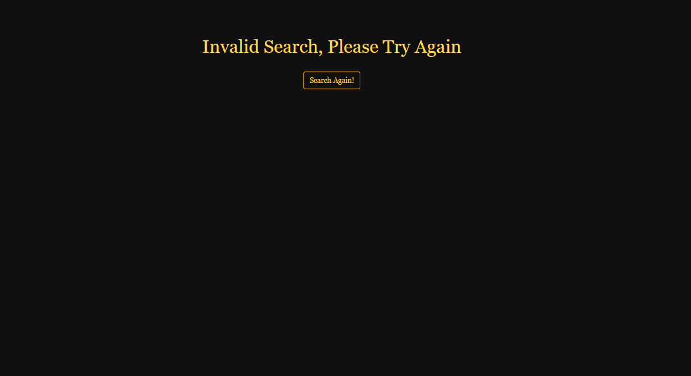

# CSC131-Group-project

Step To start and run this project: 
1. Fork and Clone the project file
2. Install node_modules : run npm install in terminal (make sure you are in the corect path /CSC131-Movie-project )
3. To run UI on Web Browser: run node front-end.js (http://localhost:8080/)
4. To run RESTful API : run node app.js     (tested in Postman)

Final Mockup:

Search Page:

    

Result Page:

    

Invalid Page:

    

