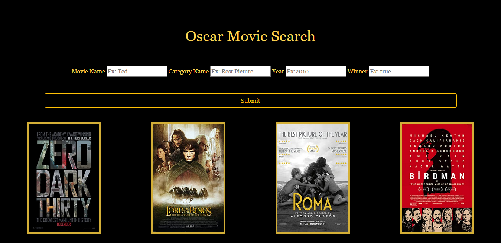

# Oscars Movie Search Project CSC 131
Purpose: This project creates a front-end UI and restfulAPI that allows users to search for oscar nominated and oscar winning movies based on their name, category, ceremony year, and winner status. This project was created as part of a team in my Software Engineering CSC 131 course and demonstrates knowledge of nodeJS,html, bootstrap, css, API functionality, error handling, and, more broadly, full stack development. 

Step To start and run this project: 
1. Fork and Clone the project file
2. Install node_modules : run npm install 
3. To run UI on Web Browser: run node front-end.js (http://localhost:8080/)
4. To run RESTful API : run node app.js. Use the URL localhost:8080/movies/search and input any combination of name,category, year, and winner or index to reach an endpoint. For example, you can input localhost:8080/movies/search?category=best picture&year=2000&&winner=false and receive json data of all the movies that did not win but were nominated for the oscar of best picture in 2000.

Final Mockup:

Search Page:

    

Result Page:

    

Invalid Page:

    

